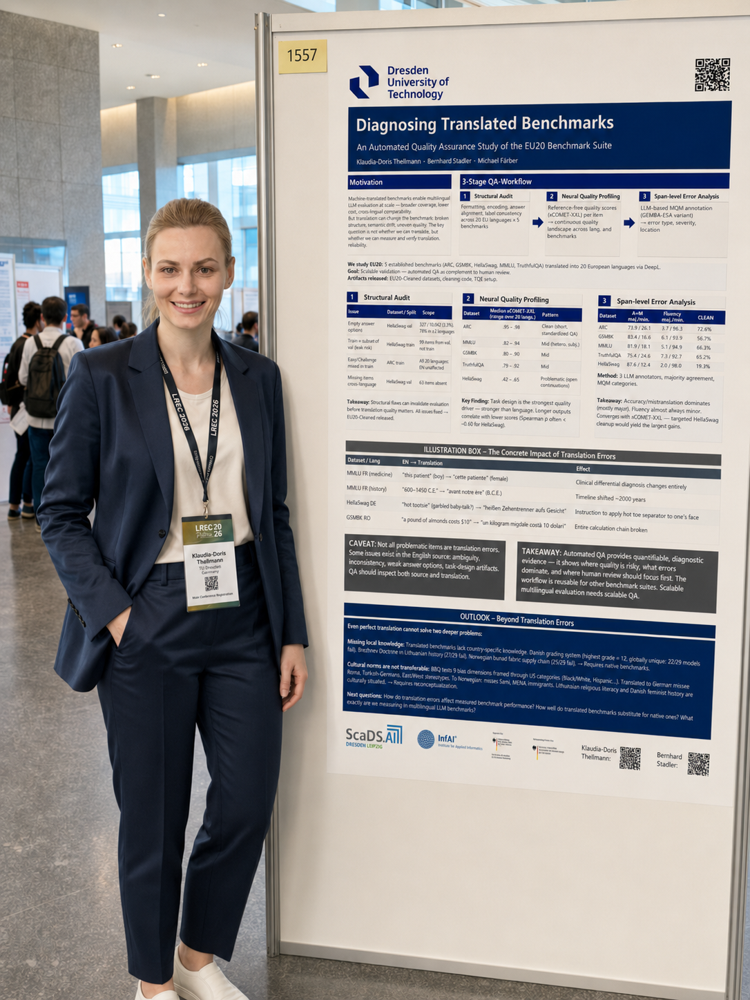

In May 2026, I presented our work **“Diagnosing Translated Benchmarks: An Automated Quality Assurance Study of the EU20 Benchmark Suite”** at LREC.

This post collects the main idea of the paper, a few conference highlights, and links to material that may be useful for researchers working on multilingual LLM evaluation.

<!--more-->

## Why this paper matters

Translated benchmarks are widely used to evaluate multilingual LLMs. However, translation artifacts can change the difficulty, ambiguity, or even the correct answer of benchmark items. Our study looks at automated ways to identify such issues at scale.

## Main takeaways

- Translation quality is not just a preprocessing detail; it can directly affect benchmark validity.
- Automated QA can help identify suspicious items before a benchmark is used for model comparison.
- Multilingual evaluation pipelines need transparent documentation of translation and validation steps.

## Conference highlights


## Photos

```text
content/blog/lrec-2026-eu20-benchmark-qa/images/lrec_venue_1.jpg
content/blog/lrec-2026-eu20-benchmark-qa/images/lrec_poster.png
content/blog/lrec-2026-eu20-benchmark-qa/images/lrec_venue_2.png
content/blog/lrec-2026-eu20-benchmark-qa/images/lrec_venue_3.jpeg
```

```markdown

```

## Links

- Paper: TODO
- Code repository: TODO
- Dataset / benchmark material: TODO
- Slides / poster: TODO

## Citation

